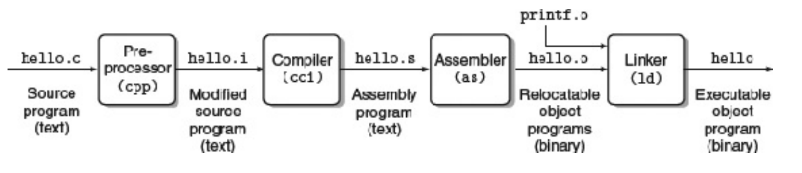
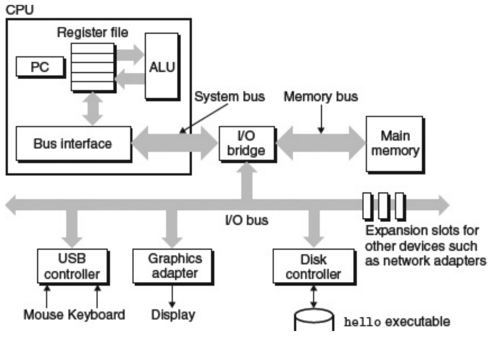
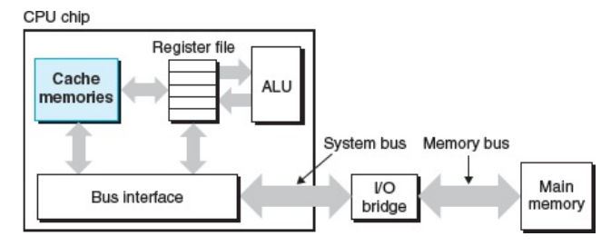
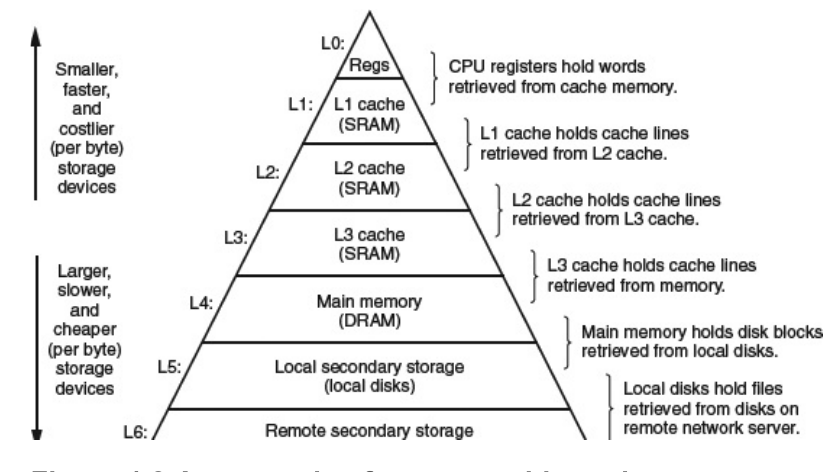
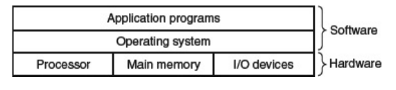
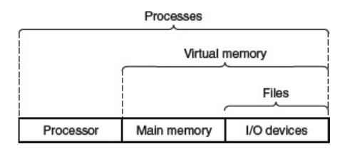
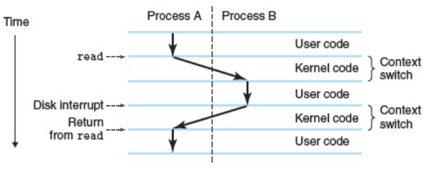
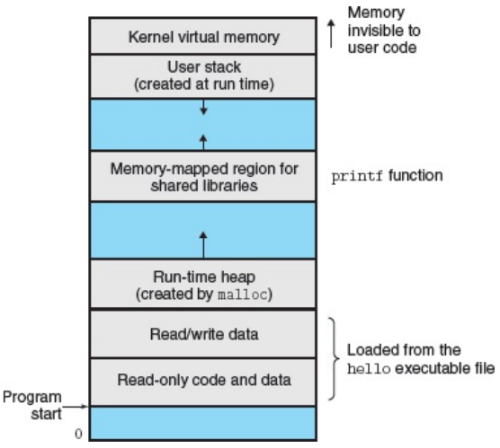

# A Tour of Computer Systems
```c
#include <stdio.h>

int main()
{
	printf("hello, world\n");
	return 0;
}
```

## Compilation System

```
gcc -o hello hello.c
```

- `GCC` is a C compiler
- `-o` basically says output our source code (`hello.c`) in `<file>`(`hello`)
- `hello` is the name we want for our executable
- `hello.c` is our source code file

The programs that perform the four phases in the diagram are known as the *compilation system*.

1. **Preprocessing Phase**
	- The preprocessor modifies the original C program according to the directives.
	- Result is another C program with the `.i` suffix.
2. **Compilation Phase**
	- `.i` -> `.s` (assembly language)
3. **Assembly Phase**
	- `.s` to machine language instructions and packages them in a form as a *relocatable object program*
	- `.o`
4. **Linking Phase**
	- Merges (in this case, our `hello` program) the `printf` function (which resides in a separate precompiled object file) with our `hello.o` program.
	- Result is `hello` executable

---
## Hardware Organization of a System


- **Buses**
	- Collection of electrical conduits that carry bytes of information back and forth between components.
	- Typically designed to transfer fixed-sized bytes known as *words*.
		- Either 4 bytes (32 bits) or 8 bytes (64 bits).
- **I/O Devices**
	- Input/Output
	- System's connection to the external world.
	- Each I/O is connected to the I/O bus by either a controller or an adapter.
	- *Controllers* are chips sets on the device itself or on the motherboard.
	- *Adapters* plugs into the motherboard.
- **Main Memory**
	- Temporary storage device that holds the progam & data while the processor is executing the program.
	- Consist of a collection of *dynamic random access memory*(DRAM) chips.
	- Organized as a linear array of bytes with it's own unique address that starts at 0.
- **Processor**
	- Also called the *central processing unit* (CPU).
	- Interprets/Executes instructions stored in the main memory.
	- At its core is a word-size storage device (*register*) called the *program counter* which at any point in time, points at some instruction in main memory.
	- Operates to a very simple instruction execution model, defined by its *instruction set architecture*, where instructions are exectud in a strict sequence:
		- Processor reads instruction from memory pointed out by the PC.
		- Interprets the bits in the instruction
		- Perform operation dictated by the instruction.
		- Updates PC to point at the next instruction.
	- These operations mainly revolve around the main memory, register file, and ALU.
		- *ALU* - computes new data and address values.

---

## Running our `hello` program

1. As we type `./hello` on our keyboard, the shell program reads each input in to a register and stores it in memory.
2. Hitting the `<RET>` key on our keyboard signifies the shell that we have finished executing that command.
3. The shell loads the executable `hello` file by executing a sequence of instructions that copies the the code and data in the `hello` object file from disk to main memory.
	- Using a technique called *direct memory access*(DMA), data travels from the disk to the main memory without passing through the processor
4. Once the code and data in `hello` are loaded in memory, the processor executes the instruction in the `hello` program's `main` routine.
5. These instructions copy the bytes in the `hello, world\n` string from memory to register file, to the display device.

---

## Caches

From running our `hello` program, we can see that a lot of work involves copying from one component to the next, which slows down the program. 

With the current technology, it is also more expensive the make memory faster than to make processors faster leading to a problem called the *processsor-memory gap*.

*Cache memories* (or simply *caches*) are the solution to this gap for faster storage devices which serve as *temporary* staging areas for information that the processor might need in the future.



There are different levels to cache memory. There are what's called L1 caches, L2 caches, and so on. L1 caches for this example can probably hold about tens of thousands of bytes and have the speed nearly as fast as a register. L2 caches on the other hand are larger, which can probably hold 1,000 - 1,000,000+ bytes but at the expense of speed. It might be slower, say around 5 times slower than an L1 cache but it still is way faster than accesssing the main memory. L1 and L2 caches are implemented with hardware technology known as *static random access memory*(SRAM).

The idea for caching is that the system can have both a large memory and a fast one by exploting what is called **locality**, the tendency for programs to access data and code in localized regions.

---

## Memory Hierarchy

Storage devices in every computer system are organized as a memory hierarchy.



As we move from the top to the bottom, the devices becomes slower, larger, and less cost per byte.

The main idea of a memory hierarchy is that the storage at one level serves as a cache storage for the lower level. Thus register file is a cache for the L1 cache, L1 cache for the L2 cache, and so on.

---

## OS Manages the Hardware

Going back to the `hello` program, when the program was loaded and when it was printed on the screen, neither program accessed the keyboard, disk, display or main memory directly. It relied on the services provided by the operating system.



All attempts by the application to manipulate hardware must go through the operating system.

The OS has 2 primary purposes:
1. To protect the hardware from misuse by runaway applications.
2. To provide applications with a simple and uniform mechanism for manipulating complicated and often wildly different low-level hardware devices.

The OS achieves both purposes via the fundamental abstractions, *processes*, *virtual memory*, and *files*. 



Files are abstractions for I/O devices, virtual memory for main memory and disk, and processes for processor, main memory, and I/O devices. 

### Processes

When `hello` runs, the OS provides the illusion that it is the only one running in the system. The program appears to have exclusive use of the processor, main memory, and I/O devices. The processor appears to execute the instructions in the program without interruption. The code and data of the program appear to be the only objects in memory. 

These illusions are provided by the notion of a process. 

A *process* is the OS abstraction for running programs. Multiple processes can run concurrently on the same system and each process appears to have exclusive use of the hardware. 

A single CPU can execute multiple processes concurrently by having the processor switch among them which is called *context switching*. 

The OS keeps track all of the state information that is needed for the process to run. This state is called the *context*  which includes the following:
- Current values of the PC
- Register file
- Contents of the main memory

When a processor executes a context switch, which happens when the processor decides to transfer control from the current process to some
new process, it saves the context of the current process, restoring the contents of the new process, and passing control to the new process. The new process picks up where it left off. 



The transition from one process to another is managed by the OS *kernel*. It is the portion of the OS that always resides in memory. 

When an application requires some action by the OS such as read/write a file, it executes a *system call* instruction, transfers control to the kernel, then the kernel performs the instruction and transfers control back to the application. 

### Threads

Threads are multiple execution units with each running in the context of the process and sharing the sane code and global data. 


### Virtual Memory

VM is an abstraction that provides each process with the illusion that it has exclusive use of the main memory. Each process has the same unifrom view of memory known as its *virtual address space*.



Virtual address space seen by each process consists of well-defined areas, each with a specific purpose:
- **Program code and data**
	- Code begins at the same fixed address for all processes followed by data locations that correspond to global C variables.
	- Code and data areas are initialized from the contents of an executable.
- **Heap**
	- Expands and contracts dynamically at run time as a result of calls to C standard library routines such as `malloc` and `free`.
- **Shared libraries**
	- Holds code and data for shared libraries such as C standard library.
- **Stack**
	- Used by the compiler to implement function calls.
	- Also expands and contracts dynamically, like the heap, during the execution of the program.
	- Grows whenever we call a function, and contracts when we return from a function.
- **Kernel virtual memory**
	- Top most region of the address space.
	- Invoked by application programs to perform functions defined in the kernel code.

### Files

File is just a sequence of bytes. Every I/O device, disks, keyboards, even networks, is modeled as a file.

All I/O is performed by reading and writing files using a small set of system calls known as *Unix I/O*.

---

## System Communication Using Networks

