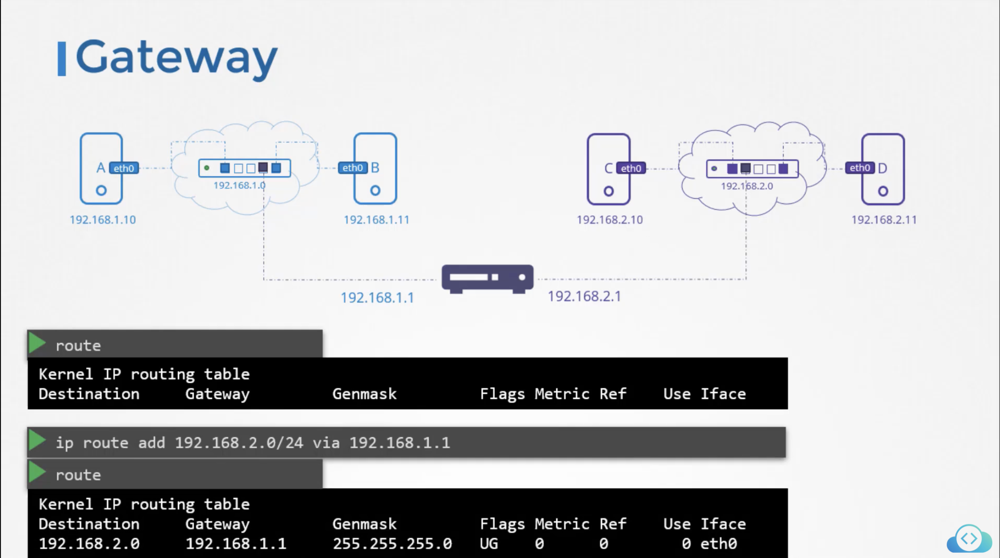

# Table of Contents

-   [Switching](#switching)
-   [Routing](#routing)
-   [Gateway](#gateway)
    -   [Default Gateway](#default-gateway)
-   [Forwarding Packets](#forwarding-packets)
-   [DNS](#dns)
    -   [Domain Names](#domain-names)
-   [Record Types](#record-types)
-   [nslookup](#nslookup)
-   [dig](#dig)

# Switching

Switching connnects systems within the same network.

To connect the two systems:

1.  We need an interface on each host, physical or virtual. a. We use
    the `ip link` command to see the interfaces for the hosts
2.  We assign then the systems with ip addresses on the same network
    using `ip addr add <ip>/24 dev eth0`.

`ip` - command for interacting with network devices in Linux

`addr` - subcommand to manipulate IP addresses and routes

`add` - option to add an IP address

`<ip>/24` - IP address being assigned while `/24` basically says that it's a subnet with 256 addresses (from 192.168.1.0 to 192.168.1.255)

`dev eth0` - network interface the IP is being assigned (could be gotten from `ip link`, `eth0` in this case)

We can also use `ip addr show` to see the IP of the system.

# Routing

Routing is the use of routers to connect to different networks together.

In is assigned two IPs since it is connected to two separate networks.

# Gateway

It is basically a "gateway" where systems can "pass-through" to
reach another system in another network via a router.

`route` is used to see the existing routing configuration on the system.

We use the command `ip route add <destination_ip>/24 via <gateway_ip>`
to configure a gateway from the system to reach a destination network.

The destination IP can end with `.0` followed by `/24` which applies to
the range of IP from `.0` to `.255`.



Note that in setting up routing, it should be configured in all systems.

## Default Gateway

``` shell
ip route add default via <ip>
```

For any network we don't know a route to, use this router as a default
gateway.

Instead of default we can say use `0.0.0.0`

# Forwarding Packets

``` shell
cat /proc/sys/net/ipv4/ip_forward

# if 1 then ip forwarding is enabled and 0 if not
```

# DNS

**Name resolution** is the process of translating host name to IP
address when used in a command.

To "assign" a name to an IP address we edit the file `/etc/hosts`.

Example:

We can run the command `cat >> /etc/hosts`. Take note that we use `>>`
instead of a single `>` as the former appends to the file while the
latter rewrites the file with the new content.

```
192.168.1.11 db
192.168.1.11 www.google.com
```

Note that we can assign multiple names to an IP address. We can use the
name instead of an IP in commands.

``` shell
ssh db
ping db
```

Increase in additional systems resulted in adding more entries in our
`/etc/hosts` file which became harder to manage thus moving all the
entries to a single server that would manage it centrally called the
**DNS server**

Inside `/etc/resolv.conf`, we put the directive `nameserver` and the IP
`192.168.1.100` which are DNS server IP address so that any DNS-related
queries will query the DNS servers listed on the `resolv.conf` file.

```
nameserver 192.168.1.100
```

## Domain Names

`.com, .net, .org, .edu, etc` are the top level domain names that
represent the intent of the website.

`google, facebook, netflix, etc` are the domain name assigned

`www.` is the subdomain which helps in further grouping things together.

If we list same domain names with different subdomains, we should use
the whole domain name when using it (like `web.mycompany.com` instead of
`web`)

To use just the subdomain we can specify it in our `resolv.conf` file
using the `search` directive.

```
# /etc/resolv.conf

nameserver 192.168.1.100
search mycompany.com prod.mycompany.com
```

This would exclude \"mycompany.com\" and \"prod.mycompany.com\" so that
we can just use `web`.

# Record Types

Records are stored in the DNS server.

IP = "A" records 

IPV6 = quad "A" records 

Mapping name to another name = CNAME records

| Record Type | Type            | Address                                 |
|-------------|-----------------|-----------------------------------------|
| A           | web-server      | 192.168.1.1                             |
| AAAA        | web-server      | 2001:0db8:85a3:0000:0000:8a2e:0370:7334 |
| CNAME       | food.web-server | eat.web-server, hungry.web-server       |

# nslookup

There are times that `ping` might not be the best tool for testing DNS
resolution.

`nslookup` queries host name from a DNS server. (Note that it does not
consider the entries in the local `/etc/hosts` file)

# dig

Same with `nslookup` but with more details.
